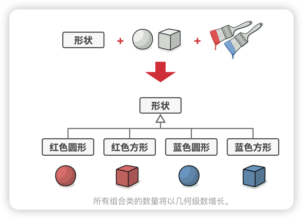
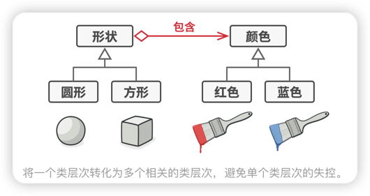
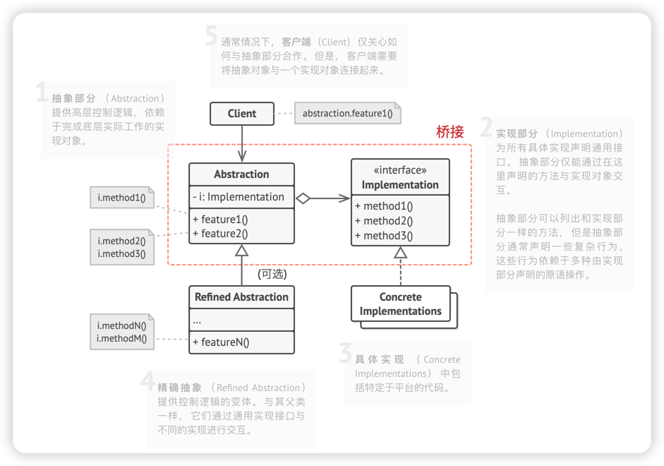
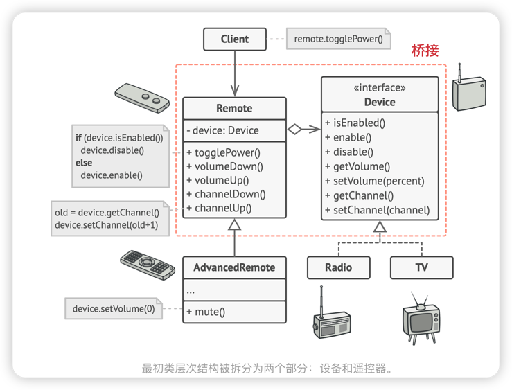

# 桥接模式
> **桥接模式**是一种结构型设计模式， 可将一个大类或一系列紧密相关的类拆分为**抽象**和**实现**两个**独立的层次结构**， 从而能在开发时分别使用。

## 问题
假如你有一个几何 形状Shape类， 从它能扩展出两个子类： ​ 圆形Circle和 方形Square 。 你希望对这样的类层次结构进行扩展以使其包含颜色， 所以你打算创建名为 红色Red和 蓝色Blue的形状子类。 但是， 由于你已有两个子类， 所以总共需要创建四个类才能覆盖所有组合， 例如 蓝色圆形Blue­Circle和 红色方形Red­Square 。

在层次结构中新增形状和颜色将导致代码复杂程度指数增长。 例如添加三角形状， 你需要新增两个子类， 也就是每种颜色一个； 此后新增一种新颜色需要新增三个子类， 即每种形状一个。 如此以往， 情况会越来越糟糕。

## 解决方案
问题的根本原因是我们**试图在两个独立的维度——形状与颜色——上扩展形状类**。 这在处理类继承时是很常见的问题。

桥接模式**通过将继承改为组合的方式**来解决这个问题。 具体来说， 就是**抽取其中一个维度并使之成为独立的类层次**， 这样就可以在初始类中引用这个新层次的对象， 从而使得一个类不必拥有所有的状态和行为。

根据该方法， 我们可以将颜色相关的代码抽取到拥有 红色和 蓝色两个子类的颜色类中， **然后在 形状类中添加一个指向某一颜色对象的引用成员变量**。 现在， **形状类可以将所有与颜色相关的工作委派给连入的颜色对象**。 这样的引用就成为了 形状和 颜色之间的桥梁。 此后， 新增颜色将不再需要修改形状的类层次， 反之亦然。

## 抽象部分和实现部分
**抽象部分** （也被称为接口） 是一些实体的**高阶控制层**。 **该层自身不完成任何具体的工作**， 它**需要将工作委派给实现部分层** （也被称为平台）。

(注意， 这里提到的内容与编程语言中的接口或抽象类无关。 它们并不是一回事。)

## 桥接模式结构

## 伪代码
示例演示了**桥接**模式如何拆分程序中同时管理设备及其遥控器的庞杂代码。设备(Device)类作为实现部分，而遥控器(Remote)类则作为抽象部分。

遥控器基类**声明了一个指向设备对象的引用成员变量**。 **所有遥控器通过通用设备接口与设备进行交互**， 使得同一个遥控器可以支持不同类型的设备。

你可以开发独立于设备类的遥控器类， 只需新建一个遥控器子类即可。 例如， 基础遥控器可能只有两个按钮， 但你可在其基础上扩展新功能， 比如额外的一节电池或一块触摸屏。

## 桥接模式适合应用场景
- 如果你想要拆分或重组一个具有多重功能的庞杂类(例如能与多个数据库服务器进行交互的类)，可以使用桥接模式。
> 类的代码行数越多， 弄清其运作方式就越困难， 对其进行修改所花费的时间就越长。 一个功能上的变化可能需要在整个类范围内进行修改， 而且常常会产生错误， 甚至还会有一些严重的副作用。
> 
> 桥接模式可以**将庞杂类拆分为几个类层次结构**。 此后， 你可以修改任意一个类层次结构而不会影响到其他类层次结构。 这种方法可以简化代码的维护工作， 并将修改已有代码的风险降到最低。

- 如果你希望在几个独立纬度上拓展一个类，可使用该模式
> 桥接建议**将每个维度抽取为独立的类层次**。 **初始类将相关工作委派给属于对应类层次的对象**， 无需自己完成所有工作。

- 如果你需要在运行时切换不同实现的方法，可使用桥接模式
> 当然并不是说一定要实现这一点， 桥接模式可替换抽象部分中的实现对象， 具体操作就和给成员变量赋新值一样简单。

## 实现方式
1. 明确类中独立的维度。 独立的概念可能是： 抽象/平台， 域/基础设施， 前端/后端或接口/实现。
2. 了解客户端的业务需求， 并在抽象基类中定义它们。
3. 确定**在所有平台上都可执行的业务**。 并**在通用实现接口中声明抽象部分所需的业务**。
4. 为你域内的**所有平台创建实现类**， 但需确保它们**遵循实现部分的接口**。
5. 在抽象类中**添加指向实现类型的引用成员变量**。 **抽象部分会将大部分工作委派给该成员变量所指向的实现对象**。
6. 如果你的高层逻辑有多个变体， 则可**通过扩展抽象基类为每个变体创建一个精确抽象**。
7. 客户端代码**必须将实现对象传递给抽象部分的构造函数才能使其能够相互关联**。 此后， **客户端只需与抽象对象进行交互， 无需和实现对象打交道**。

## 桥接模式优缺点
### 优点
- 你可以创建与平台无关的类和程序。
- 客户端代码仅与高层抽象部分进行互动， 不会接触到平台的详细信息。
- 开闭原则。 你可以新增抽象部分和实现部分， 且它们之间不会相互影响。
- 单一职责原则。 抽象部分专注于处理高层逻辑， 实现部分处理平台细节。
### 缺点
- 对高内聚的类使用该模式可能会让代码更加复杂。

## 与其他模式的关系
- 桥接模式通常会于开发前期进行设计， 使你能够将程序的各个部分独立开来以便开发。 另一方面， 适配器模式通常在已有程序中使用， 让相互不兼容的类能很好地合作。
- 桥接、 状态模式和策略模式 （在某种程度上包括适配器） 模式的接口非常相似。 实际上， 它们都基于组合模式——即将工作委派给其他对象， 不过也各自解决了不同的问题。 模式并不只是以特定方式组织代码的配方， 你还可以使用它们来和其他开发者讨论模式所解决的问题。
- 你可以将抽象工厂模式和桥接搭配使用。 如果由桥接定义的抽象只能与特定实现合作， 这一模式搭配就非常有用。 在这种情况下， 抽象工厂可以对这些关系进行封装， 并且对客户端代码隐藏其复杂性。
- 你可以结合使用生成器模式和桥接模式： 主管类负责抽象工作， 各种不同的生成器负责实现工作。

