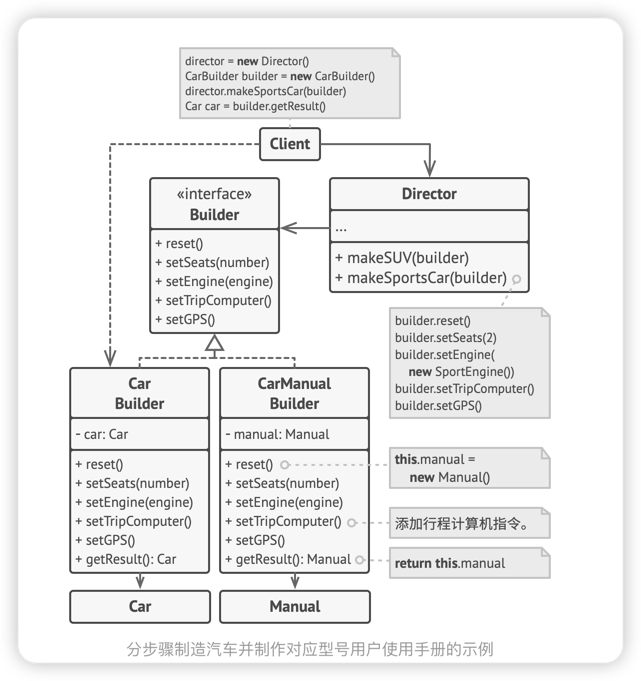

# 生成器模式
> 生成器模式是一种创建型设计模式，使你能够分步骤创建复杂对象。该模式允许你使用相同的创建代码生产不同类型和形式的对象

## 问题
复杂对象在其进行构造时需要对诸多成员变量和嵌套对象进行频繁的初始化工作。这些初始化代码通常深藏于一个包含众多参数且让人基本看不懂的构造函数中； 甚至还有更糟糕的情况， 那就是这些代码散落在客户端代码的多个位置。

> 如果对于一个对象中含有多个组件，创建很多子类会导致类太多，如果搞一个all in one的类又会导致其实很多参数是无效的
- 如果为每种可能的对象都创建一个子类，这可能会导致程序变得过于复杂
- 拥有大量输入参数的构造函数也有缺陷:这些参数也不是每次都要全部用上

## 解决方案
> 生成器模式建议将对象构造代码从产品类中抽取出来， 并将其放在一个名为生成器的独立对象中。

该模式会将对象构造过程划分为一组步骤， 比如 build­Walls创建墙壁和 build­Door创建房门创建房门等。 每次创建对象时， 你都需要通过生成器对象执行一系列步骤。 重点在于你无需调用所有步骤， 而只需调用创建特定对象配置所需的那些步骤即可。

当你需要创建不同形式的产品时， 其中的一些构造步骤可能需要不同的实现。 例如， 木屋的房门可能需要使用木头制造， 而城堡的房门则必须使用石头制造。

在这种情况下， **你可以创建多个不同的生成器， 用不同方式实现一组相同的创建步骤**。 然后你就可以在创建过程中使用这些生成器 （例如按顺序调用多个构造步骤） 来生成不同类型的对象。

## 主管
你可以进一步**将用于创建产品的一系列生成器步骤调用抽取成为单独的主管类**。 主管类可定义创建步骤的执行顺序， 而生成器则提供这些步骤的实现。
> 主管类中非常适合放入各种例行构造流程，以便在程序中反复使用；对于客户端代码来说，主管类完全隐藏了产品构造细节。客户端只需要一个生成器与主管类关联，然后使用主管类来构造产品，就能从生成器处获取构造结果了

## 生成器模式结构

## 伪代码
下面关于生成器模式的例子演示了你可以如何复用相同的对象构造代码来生成不同类型的产品——例如汽车 （Car）——及其相应的使用手册 （Manual）。

## 应用场景
1. 使用生成器模式可避免 “重叠构造函数 （telescoping constructor）” 的出现。
> 假设你的构造函数中有十个可选参数， 那么调用该函数会非常不方便； 因此， 你需要重载这个构造函数， 新建几个只有较少参数的简化版。 但这些构造函数仍需调用主构造函数， 传递一些默认数值来替代省略掉的参数。
> 生成器模式让你可以分步骤生成对象， 而且允许你仅使用必须的步骤。 应用该模式后， 你再也不需要将几十个参数塞进构造函数里了。

2. 当你希望使用代码创建不同形式的产品 （例如石头或木头房屋） 时， 可使用生成器模式。
> 如果你需要创建的各种形式的产品， 它们的制造过程相似且**仅有细节上的差异**， 此时可使用生成器模式。

> 基本生成器接口中定义了所有可能的制造步骤， 具体生成器将实现这些步骤来制造特定形式的产品。 同时， 主管类将负责管理制造步骤的顺序。

3. 使用生成器构造组合树或者其他复杂对象
>  生成器模式让你能分步骤构造产品。 你可以延迟执行某些步骤而不会影响最终产品。 你甚至可以递归调用这些步骤， 这在创建对象树时非常方便。
> 生成器在执行制造步骤时， 不能对外发布未完成的产品。 这可以避免客户端代码获取到不完整结果对象的情况。

## 实现方法
1. 清晰地定义通用步骤， 确保它们可以制造所有形式的产品。 否则你将无法进一步实施该模式。
2. 在基本生成器接口中声明这些步骤。
3. 为每个形式的产品创建具体生成器类， 并实现其构造步骤。
> 不要忘记实现获取构造结果对象的方法。 你不能在生成器接口中声明该方法， 因为不同生成器构造的产品可能没有公共接口， 因此你就不知道该方法返回的对象类型。 但是， 如果所有产品都位于单一类层次中， 你就可以安全地在基本接口中添加获取生成对象的方法。

4. 考虑创建主管类。 它可以使用同一生成器对象来封装多种构造产品的方式。

5. 客户端代码会同时创建生成器和主管对象。 构造开始前， 客户端必须将生成器对象传递给主管对象。 通常情况下， 客户端只需调用主管类构造函数一次即可。 主管类使用生成器对象完成后续所有制造任务。 还有另一种方式， 那就是客户端可以将生成器对象直接传递给主管类的制造方法。

6. 只有在所有产品都遵循相同接口的情况下， 构造结果可以直接通过主管类获取。 否则， 客户端应当通过生成器获取构造结果。

## 生成器模式
### 优点
1. 你可以分步创建对象， 暂缓创建步骤或递归运行创建步骤。
2. 生成不同形式的产品时， 你可以复用相同的制造代码。
3. 单一职责原则。 你可以将复杂构造代码从产品的业务逻辑中分离出来。

### 缺点
1. 由于该模式需要新增多个类， 因此代码整体复杂程度会有所增加。

## 与其他模式的关系
- 在许多设计工作的初期都会使用**工厂方法模式** （较为简单， 而且可以更方便地通过子类进行定制）， 随后演化为使用抽象工厂模式、 原型模式或生成器模式 （更灵活但更加复杂）。
- **生成器**重点关注如何分步生成复杂对象。 **抽象工厂**专门用于生产一系列相关对象。 抽象工厂会马上返回产品， 生成器则允许你在获取产品前执行一些额外构造步骤。
- 你可以在创建复杂组合模式树时使用生成器， 因为这可使其构造步骤以递归的方式运行。
- 你可以结合使用**生成器**和**桥接模式**： 主管类负责抽象工作， 各种不同的生成器负责实现工作。
- **抽象工厂**、 **生成器**和**原型**都可以用**单例模式**来实现。

