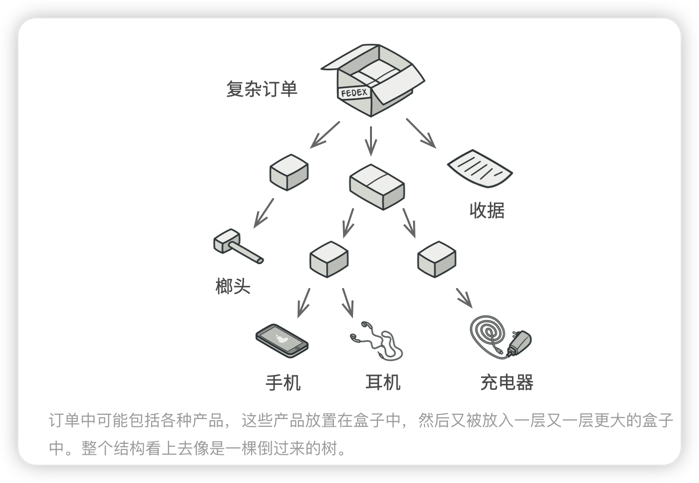
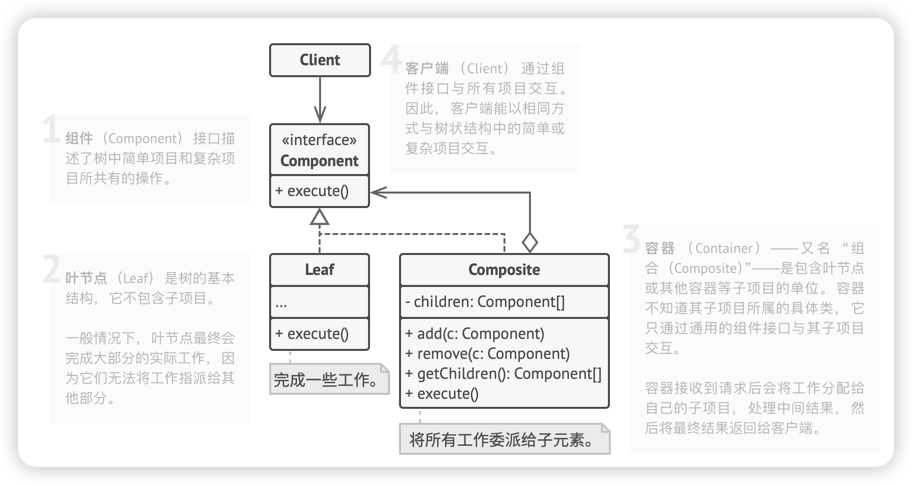
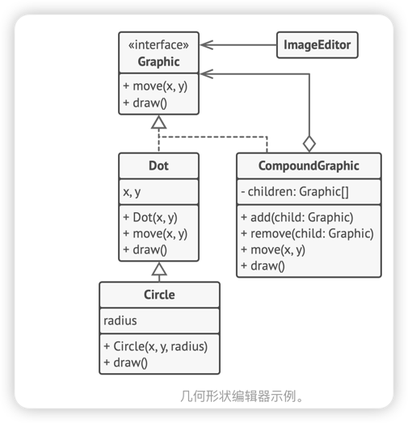

# 组合模式
> 组合模式是一种结构型设计模式，你可以使用它将对象组合成树状结构，并且能像使用独立对象一样使用它们。
> 
> 多个对象的一个

## 问题
如果应用的核心模型能用树状结构表示， 在应用中使用组合模式才有价值。

例如， 你有两类对象：产品和盒子。一个盒子中可以包含多个 产品或者几个较小的盒子。这些小盒子中同样可以包含一些 产品或更小的盒子 ，以此类推。

## 解决方案
组合模式建议**使用一个通用的接口**来与"产品" 、"盒子"进行交互，并且在该接口声明一个计算总价的方法。

那么方法该如何设计呢？ 对于一个产品， 该方法直接返回其价格； 对于一个盒子， 该方法遍历盒子中的所有项目， 询问每个项目的价格， 然后返回该盒子的总价格。 如果其中某个项目是小一号的盒子， 那么当前盒子也会遍历其中的所有项目， 以此类推， 直到计算出所有内部组成部分的价格。 你甚至可以在盒子的最终价格中增加额外费用， 作为该盒子的包装费用。

该方式的最大优点在于你**无需了解构成树状结构的对象的具体类**。你也无需了解对象是简单的产品还是复杂的盒子。你只需调用通用接口以相同的方式对其进行处理即可。 当你调用该方法后， 对象会将请求沿着树结构传递下去。

## 组合模式结构

## 伪代码
在本例中， 我们将借助组合模式帮助你在图形编辑器中实现一系列的几何图形。

组合图形CompoundGraphic是一个容器， 它可以由多个包括容器在内的子图形构成。 组合图形与简单图形拥有相同的方法。 但是， 组合图形自身并不完成具体工作， 而是将请求递归地传递给自己的子项目， 然后 “汇总” 结果。

通过所有图形类所共有的接口， 客户端代码可以与所有图形互动。 因此， 客户端不知道与其交互的是简单图形还是组合图形。 **客户端可以与非常复杂的对象结构进行交互， 而无需与组成该结构的实体类紧密耦合。**

## 组合模式适用应用场景
1. 如果你需要实现**树状结构**，可以使用组合模式
> 组合模式为你提供了两种共享公共接口的基本元素类型： 简单叶节点和复杂容器。 容器中可以包含叶节点和其他容器。 这使得你可以构建树状嵌套递归对象结构。

2. 如果你希望**客户端代码以相同方式处理简单和复杂元素**， 可以使用该模式。
> 组合模式中定义的所有元素共用同一个接口。 在这一接口的帮助下， **客户端不必在意其所使用的对象的具体类**。

## 实现方式
1. 确保应用的核心模式能够以树状结构表示。**尝试将其分解伟简单元素和容器**。记住， 容器必须能够同时包含简单元素和其他容器。
2. 声明**组件接口**及其**一系列方法**， **这些方法对简单和复杂元素都有意义**。
3. 创建一个**叶节点**类表示简单元素。 程序中可以有多个不同的叶节点类。
4. 创建一个**容器类**表示复杂元素。 在该类中， **创建一个数组成员变量来存储对于其子元素的引用**。 该数组必须能够同时保存叶节点和容器， 因此请确保将其声明为组合接口类型。

实现组件接口方法时， 记住容器应该将大部分工作交给其子元素来完成。

5. 最后， 在容器中定义添加和删除子元素的方法。
记住， 这些操作可在组件接口中声明。 这将会违反接口隔离原则， 因为叶节点类中的这些方法为空。 但是， 这可以让客户端无差别地访问所有元素， 即使是组成树状结构的元素。

## 组合模式优缺点
### 优点
- 你可以利用多态和递归机制更方便地使用复杂树结构。
- 开闭原则。 无需更改现有代码， 你就可以在应用中添加新元素， 使其成为对象树的一部分。
### 缺点
- 对于功能差异较大的类， 提供公共接口或许会有困难。 在特定情况下， 你需要过度一般化组件接口， 使其变得令人难以理解。

## 与其他模式的关系
- 桥接模式、 状态模式和策略模式 （在某种程度上包括适配器模式） 模式的接口非常相似。 实际上， 它们都基于组合模式——即将工作委派给其他对象， 不过也各自解决了不同的问题。 模式并不只是以特定方式组织代码的配方， 你还可以使用它们来和其他开发者讨论模式所解决的问题。
- 你可以在创建复杂组合树时使用生成器模式， 因为这可使其构造步骤以递归的方式运行。
- 责任链模式通常和组合模式结合使用。 在这种情况下， 叶组件接收到请求后， 可以将请求沿包含全体父组件的链一直传递至对象树的底部。
- 你可以使用迭代器模式来遍历组合树。
- 你可以使用访问者模式对整个组合树执行操作。
- 你可以使用享元模式实现组合树的共享叶节点以节省内存。
- 组合和装饰模式的结构图很相似， 因为两者都依赖递归组合来组织无限数量的对象。
  装饰类似于组合， 但其只有一个子组件。 此外还有一个明显不同： 装饰为被封装对象添加了额外的职责， 组合仅对其子节点的结果进行了 “求和”。
  但是， 模式也可以相互合作： 你可以使用装饰来扩展组合树中特定对象的行为。
- 大量使用组合和装饰的设计通常可从对于原型模式的使用中获益。 你可以通过该模式来复制复杂结构， 而非从零开始重新构造。

