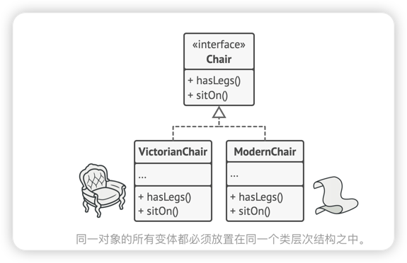
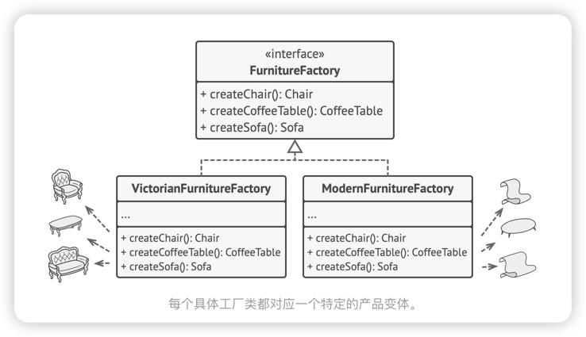
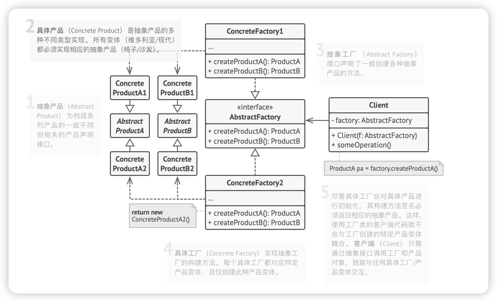

# 抽象工厂
**抽象工厂模式**是一种创建型设计模式，它能创建一系列相关对象，而无需指定其具体类。
> 工厂模式就是一个对象相关的继承关系，和一个工厂相关的继承关系，两个大分支，面对抽象接口创建，而具体实现还是要在工厂端做区分

## 解决方案
抽象工厂模式建议系列中的每件产品明确声明接口(例如椅子、 沙发或咖啡桌)。然后， 确保所有产品变体都继承这些接口。 例如， 所有风格的椅子都实现 椅子接口； 所有风格的咖啡桌都实现 咖啡桌接口， 以此类推。

接下来， 我们需要声明抽象工厂——包含系列中所有产品构造方法的接口。 例如 create­Chair创建椅子 、 ​ create­Sofa创建沙发和 create­Coffee­Table创建咖啡桌 。 这些方法必须返回抽象产品类型， 即我们之前抽取的那些接口： ​ 椅子 ， ​ 沙发和 咖啡桌等等。

那么该如何处理产品变体呢？ 对于系列产品的每个变体， 我们都将基于 抽象工厂接口创建不同的工厂类。 每个工厂类都只能返回特定类别的产品， 例如， ​ 现代家具工厂Modern­Furniture­Factory只能创建 现代椅子Modern­Chair 、 ​ 现代沙发Modern­Sofa和 现代咖啡桌Modern­Coffee­Table对象。

客户端基于抽象接口创建实体，不需要了解具体细节，一般情况下，应用程序会在初始化阶段创建具体工厂对象。而在此之前，应用程序必须根据配置文件或环境设定选择选择工厂类别。

## 抽象工厂模式结构

> 可以看出client在调用的时候还是会和抽象的工厂进行交互，而对于抽象工厂下面的具体的返回是不关心的

## 抽象工厂模式适合应用场景
- 如果代码需要与多个不同系列的相关产品交互， 但是由于无法提前获取相关信息， 或者出于对未来扩展性的考虑， 你不希望代码基于产品的具体类进行构建， 在这种情况下， 你可以使用抽象工厂。
- 抽象工厂为你提供了一个接口， 可用于创建每个系列产品的对象。 只要代码通过该接口创建对象， 那么你就不会生成与应用程序已生成的产品类型不一致的产品。
  - 如果你有一个基于一组抽象方法的类， 且其主要功能因此变得不明确， 那么在这种情况下可以考虑使用抽象工厂模式。
  - 在设计良好的程序中， 每个类仅负责一件事。 如果一个类与多种类型产品交互， 就可以考虑将工厂方法抽取到独立的工厂类或具备完整功能的抽象工厂类中。

## 抽象工厂模式优缺点
### 优点
- 你可以确保同一工厂生成的产品相互匹配。
- 你可以避免客户端和具体产品代码的耦合。
- 单一职责原则。 你可以将产品生成代码抽取到同一位置， 使得代码易于维护。
- 开闭原则。 向应用程序中引入新产品变体时， 你无需修改客户端代码。

### 缺点
- 由于采用该模式需要向应用

## 关系
在许多设计工作的初期都会使用工厂方法模式 （较为简单， 而且可以更方便地通过子类进行定制）， 随后演化为使用抽象工厂模式、 原型模式或生成器模式 （更灵活但更加复杂）。

生成器重点关注如何分步生成复杂对象。 抽象工厂专门用于生产一系列相关对象。 抽象工厂会马上返回产品， 生成器则允许你在获取产品前执行一些额外构造步骤。

抽象工厂模式通常基于一组工厂方法， 但你也可以使用原型模式来生成这些类的方法。

当只需对客户端代码隐藏子系统创建对象的方式时， 你可以使用抽象工厂来代替外观模式。

你可以将抽象工厂和桥接模式搭配使用。 如果由桥接定义的抽象只能与特定实现合作， 这一模式搭配就非常有用。 在这种情况下， 抽象工厂可以对这些关系进行封装， 并且对客户端代码隐藏其复杂性。

抽象工厂、 生成器和原型都可以用单例模式来实现。