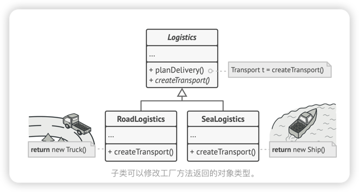
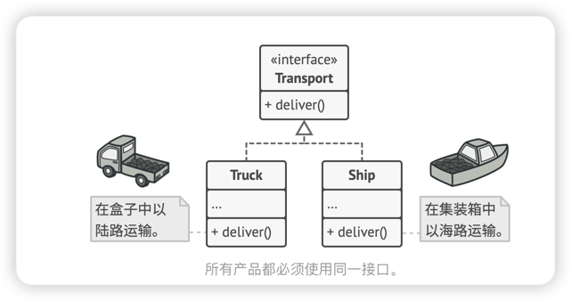
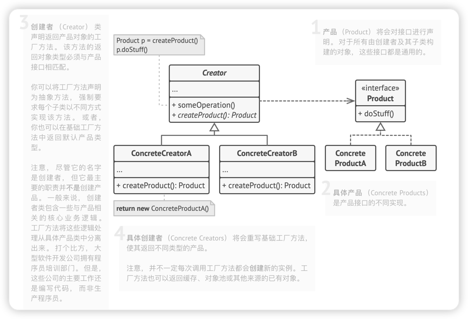

# 工厂方法模式
> `创建型设计模式`，其在父类中提供了一个创建对象的方法，允许子类决定实例化对象的类型

## 解决方案
使用特殊的工厂方法代替对于对象构造函数的直接调用，对象仍通过`new`运算符创建，只是该运算符改在工厂方法中调用罢了。工厂方法返回的对象通常被称为`产品`

我们只是改变了程序中调用构造函数的位置而已，但是，现在你可以在子类中重写工厂方法，从而改变其创建产品的类型。`但是有一点需要注意，仅当这些产品具有共同的基类或接口时，子类才能返回不同类型的产品，同时基类中的工厂方法还应将其返回类型声明伟这一共有接口`ps:就是面向接口而不是面向实现~

卡车Truck和 轮船Ship类都必须实现 运输Transport接口， 该接口声明了一个名为 deliver交付的方法。 每个类都将以不同的方式实现该方法： 卡车走陆路交付货物， 轮船走海路交付货物。 ​ 陆路运输Road­Logistics类中的工厂方法返回卡车对象， 而 海路运输Sea­Logistics类则返回轮船对象。

简单来说，

## 适用场景
1. 当你在编写代码的过程中， 如果无法预知对象确切类别及其依赖关系时， 可使用工厂方法。
> 工厂方法讲创建产品的代码和实际使用产品的代码分离，从而能在不影响其他答案的情况下拓展产品创建部分代码。例如，如果需要向应用中添加一种新产品，你只需要开发新的创建子类，然后重写其工厂方法即可。
2. 如果你希望用户能拓展你软件库或框架的内部组件，可以使用工厂方法。
>  继承可能是扩展软件库或框架默认行为的最简单方法。 但是当你使用子类替代标准组件时， 框架如何辨识出该子类？
> 解决方案是将各框架中构造组件的代码集中到单个工厂方法中， 并在继承该组件之外允许任何人对该方法进行重写。
3. 如果你希望复用现有对象来节省系统资源， 而不是每次都重新创建对象， 可使用工厂方法。

## 实现方式
1. 让所有产品都遵循`同一接口`，该接口必须声明对`所有产品都有意义的方法`。
2. 在`创建类`中添加一个`空的工厂方法`。该方法的`返回`类型必须遵循通用的`产品接口`。
3. 在创建者代码中找到`对于产品构造函数`的所有引用。将它们依次`代替为对于工厂方法`的调用，同时`将创建产品的代码`移入`工厂方法`。
4. 为工厂方法中的每个产品编写一个`创建者子类`，然后在子类中`重写工厂方法`，并将基本方法中的相关创建代码移动到工厂方法中。
可能需要在工厂方法中添加临时参数来控制返回的产品类型，工厂方法的代码会很糟糕，充斥着`swith`用于选择各种需要实例化的产品。
5. 为工厂方法中的每种产品编写一个`创建者子类`，然后在子类中重写工厂方法，并`将基本方法中的相关代码移动到工厂方法中`。
6. 如果应用中的产品类型太多，那么为每个产品创建子类并无太大必要，这时你也可以在子类中复用基类的控制参数。
7. 如果代码经过上述移动后， 基础工厂方法中已经没有任何代码， 你可以将其转变为抽象类。 如果基础工厂方法中还有其他语句， 你可以将其设置为该方法的默认行为。

## 优点
- 可以避免创建者和具体产品之间的紧密耦合。
- `单一职责`原则，可以将产品创建代码放在程序的单一位置，从而使得代码更容易维护。
- `开闭原则`，吴雨轩更改现有客户端代码，就可以在程序中1引入新的产品类型。

## 缺点
- 应用工厂方法模式需要引入许多新的子类， 代码可能会因此变得更复杂。 最好的情况是将该模式引入创建者类的现有层次结构中。

## 与其他模式的关系
- 在许多设计工作的初期都会使用工厂方法模式 （较为简单， 而且可以更方便地通过子类进行定制）， 随后演化为使用抽象工厂模式、 原型模式或生成器模式 （更灵活但更加复杂）。

- 抽象工厂模式通常基于一组工厂方法， 但你也可以使用原型模式来生成这些类的方法。

- 你可以同时使用工厂方法和迭代器模式来让子类集合返回不同类型的迭代器， 并使得迭代器与集合相匹配。

- 原型并不基于继承， 因此没有继承的缺点。 另一方面， 原型需要对被复制对象进行复杂的初始化。 工厂方法基于继承， 但是它不需要初始化步骤。

- 工厂方法是模板方法模式的一种特殊形式。 同时， 工厂方法可以作为一个大型模板方法中的一个步骤。